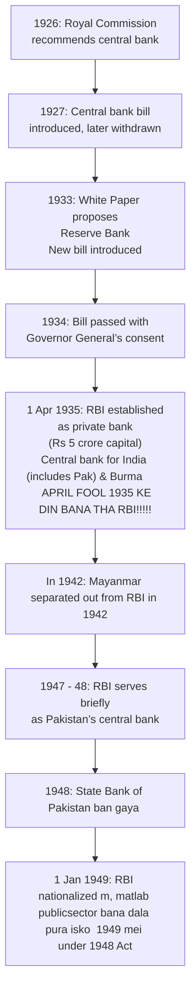
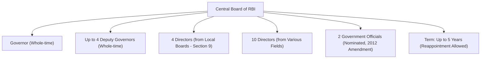
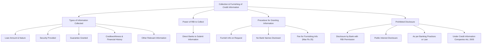

# Genesis of RBI Act (Page 165) (100% covered)

# Summary: Preamble and Structure of the RBI Act (Page 166) (100% covered)

## Preamble Highlights
- Constitutes the **Reserve Bank of India** to:
  - Regulate the issue of banknotes.
  - Maintain reserves for **monetary stability**.
  - Operate the **currency and credit system** for the country's benefit.
- Aims to implement a **modern monetary policy framework**.
- **Primary objective** of monetary policy:
  - Maintain **price stability**.
  - Support **economic growth**.

## Structure of the RBI Act (Skip this , Structure of chapters padh ke kya karegi?? )

### Chapters
- **Chapter I** – Preliminary
- **Chapter II** – Incorporation, Capital, Management and Business
- **Chapter III** – Central Banking Functions
  - **Chapter III A** – Credit Information
  - **Chapter III B** – NBFC Provisions
  - **Chapter III C** – Ban on Unincorporated Deposits
  - **Chapter III D** – Derivatives & Money Market Regulation
  - **Chapter III E** – Joint Mechanism
  - **Chapter III F** – Monetary Policy
- **Chapter IV** – General Provisions
- **Chapter V** – Penalties

### Schedules (One liner hi hai in book as well)
- **Schedule I** and **Schedule II** – Additional legal details

## Chapter I – Preliminary (RBI Act) (Sec 1 & 2)  (Page 166) (100% covered)

- **Section 1**:  
  The Act is titled the **Reserve Bank of India Act** and is applicable **throughout India**.

- **Section 2**:  
  Provides **definitions**.  
  - **Section 2(e)**: A "**scheduled bank**" refers to a bank listed in the **Second Schedule** of the Act.

## Chapter II – Incorporation, Capital, Management, and Business (RBI Act) (Page 166 - 168) (100% covered)
(Sec 3 - 19)
### Section 3 – Establishment of RBI
- RBI constituted to take over **currency management** from the Central Government.
- Incorporated as a **body corporate** with perpetual succession and a common seal.

### Section 4 – Capital
- Initial paid-up capital: **Rs 5 crores**. (Bank shuru karte waqt kuch paisa toh dena padegana kuch Apirl fools 1935 ko)
- As of 31st March 2022, total **capital reserves**: **Rs 6,741 crores**.

---

### Sections 7 & 8 – Management and Central Board

#### Section 7
- **General supervision** of RBI is entrusted to the **Central Board**.
- The Board must comply with directions from the **Central Government**, in consultation with the **Governor**.

#### Composition of the Central Board: **(Section 9 pehle padhle)**
- **Governor** (whole-time)
- **Up to 4 Deputy Governors** (whole-time)
- **4 Directors** (one from each Local Board – Section 9)
- **10 Directors** (from various fields)
- **2 Government officials** (nominated, per 2012 amendment)
- Term: **up to 5 years**, eligible for reappointment.

#### Section 8(1)(d)
- Govt. nominees serve at the **pleasure of the Government**.
- Local Board members continue during their term.
- Other directors: **4-year term** until successors are nominated.

---

### Section 9 – Local Boards
- One Local Board per region (per Schedule I), with **5 members** each.
- Appointed by the Central Government.
- Represent **territorial, economic, co-operative and indigenous banking interests**.
- Tenure: **4 years**, **max 2 terms (8 years)**.

---

### Section 11 – Removal from Office
- Central Government can remove the **Governor**, **Deputy Governor**, **Directors**, or **Local Board members**.

---

### Section 13 – Central Board Meetings
- Held **at least 6 times a year**, with **one per quarter**.
- Presided by Governor or authorized Deputy Governor.
- Governor has **casting vote** in case of a tie.

---

### Section 17 – Permitted Business of RBI
- Accept **interest-free deposits** from governments, banks, local authorities, etc.
- Conduct **forex operations**, buy/sell **securities**, **rediscount bills**, and **grant loans to banks**.
- Accept **interest-bearing deposits** under the **Standing Deposit Facility** for liquidity management.

---

### Section 18A – Validity of RBI Loans
- **RBI loans cannot be challenged** due to conflict with other laws or internal company rules.
- **Exception**: Loans to companies/societies not empowered to borrow under their own regulations.

---

### Section 19 – Prohibited Activities
RBI **cannot**:
- Engage in **trade or commercial activities**.
- Buy **shares** or provide loans against shares.
- Lend against **immovable property** (except for own use).
- Draw/accept **time bills** (only on-demand bills).
- Allow **interest on current accounts or deposits**.

### Chapter III – Central Banking Functions (PAGE 168 - 170)
(Sec 20 - 42)
Check this diagram first : 

```mermaid
graph TD
    A["Central Banking Functions"] --> B["Section 20: Banker to Central Government"]
    A --> C["Section 21A: Banker to State Governments"]
    A --> D["Section 22: Right to Issue Bank Notes"]
    A --> E["Section 24: Denomination of Currency Notes"]
    A --> F["Section 26: Legal Tender of Notes"]
    A --> G["Section 27: Re-issue of Notes"]
    A --> H["Section 28: Recovery of Lost/Stolen Notes"]
    A --> I["Section 29: Exemption from Stamp Duty"]
    A --> J["Section 30: Powers of Govt to Supersede RBI"]
    A --> K["Section 33: Assets of Issue Department"]
    A --> L["Section 34: Liabilities of Issue Department"]
    A --> M["Section 40: Transactions in Foreign Exchange"]
    A --> N["Section 42: Cash Reserve Ratio (CRR)"]
```

- **Section 20** – **Banker to the Central Government**: 
  - RBI manages the Central Government’s banking operations (exchange, remittance, public debt).
  
- **Section 21A** – **Banker to State Governments**: 
  - RBI may manage state government money, remittance, and banking transactions by agreement.

- **Section 22** – **Right to Issue Bank Notes**: 
  - RBI has the exclusive right to issue currency notes in India. The Central Government will stop issuing currency notes once this section is in effect.

- **Section 24** – **Denomination of Currency Notes**: 
  - Specifies denominations (e.g., 2, 5, 10, 1000 rupees). The Central Government may recommend discontinuing certain denominations.

- **Section 26** – **Legal Tender Character of Currency Notes**: 
  - All bank notes are legal tender in India. Some notes may cease to be legal tender upon recommendation by the Central Board.

- **Section 27** – **Re-issue of Notes**: 
  - RBI does not re-issue torn, defaced, or excessively soiled bank notes.

- **Section 28** – **Recovery of Lost or Stolen Notes**: 
  - No right to recover the value of lost or stolen notes, but RBI may refund value under specific conditions.

- **Section 29** – **Exemption from Stamp Duty**: 
  - RBI is exempt from paying stamp duty on the bank notes it issues.

- **Section 30** – **Powers of the Central Government to Supersede RBI**: 
  - The Central Government can supersede the RBI’s Central Board if it fails to meet obligations and assign another agency to control.

- **Section 33** – **Assets of the Issue Department**: 
  - Includes gold, foreign securities, and rupee coins equal to the liabilities of the Issue Department.

- **Section 34** – **Liabilities of the Issue Department**: 
  - Liabilities are equal to the total value of currency and bank notes in circulation.

- **Section 40** – **Transactions in Foreign Exchange**: 
  - RBI buys/sells foreign exchange at rates determined by the Central Government, with a minimum transaction value of Rs 2 lakhs.

- **Section 42** – **Cash Reserve Ratio (CRR)**: 
  - Scheduled banks must maintain a cash reserve ratio with RBI based on a percentage of their demand and time liabilities (DTL), as notified by RBI.

### Chapter III – A Collection and Furnishing of Credit Information (page 170 -171)

**Sections 45A to 45G**

This chapter deals with the collection and furnishing of credit information and includes the following types of information:
- Amount or nature of loans and advances provided by banking companies to borrowers.
- Nature of security provided by borrowers for these loans.
- Guarantees granted by banking companies to customers.
- Creditworthiness, financial history, and antecedents of borrowers.
- Any additional information deemed relevant by the RBI.

#### Power of RBI to Collect Credit Information:
- RBI can collect credit information in any manner it deems appropriate.
- RBI can direct banks to submit credit information statements.
- All banking companies must comply with RBI regulations.

#### Procedure for Granting Credit Information to Banking Companies:
- Upon request, the RBI provides credit information to banking companies.
- The provided information does not disclose the names of the banks that requested it.
- RBI may charge a fee for furnishing the information, not exceeding Rs 25.

#### Disclosure of Information Prohibited:
- Credit information must remain confidential.
- Disclosure of this information is prohibited except for specific purposes, including:
  - Disclosure by a banking company with RBI’s prior permission.
  - Publication for public interest, if deemed appropriate by the bank.
  - Disclosure as per customary banking practices or permitted by law.
  - Disclosure under the **Credit Information Companies (Regulation) Act, 2005**.

### Chapter III – A Collection and Furnishing of Credit Information (Page 171 - 172)

**Sections 45A to 45G**

This chapter covers the collection and furnishing of credit information, including:
- Loan/advance amounts and types.
- Nature of security and guarantees.
- Creditworthiness and financial history of borrowers.
- Any other relevant information as deemed by the RBI.

#### RBI’s Power to Collect Credit Information:
- RBI can collect and direct banks to submit credit data.
- Banks must comply with RBI regulations.

#### Granting Credit Information:
- RBI provides credit info to banks on request.
- Information provided does not reveal requesting banks' names.
- RBI may charge a fee (max Rs 25).

#### Disclosure Restrictions:
- Credit information is confidential and can only be disclosed for:
  - Disclosure with RBI’s approval.
  - Public interest publication by banks.
  - As per law or banking practices.
  - Under the **Credit Information Companies (Regulation) Act, 2005**.

---

**Additional Sections (45IB, 45IC, 45J, 45L, 45M, 45MA, 45MC, 45N)**

- **45IB**: Details on how credit information should be maintained.
- **45IC**: Ensures accuracy and timeliness of credit data.
- **45J**: Penalties for non-compliance in credit data management.
- **45L**: Procedures for handling disputes in credit info.
- **45M**: Guidelines for informing individuals about their credit reports.
- **45MA**: Establishes credit information companies.
- **45MC**: Defines duties and confidentiality for credit info companies.
- **45N**: RBI's regulatory powers over credit information companies.

# Chapter III-C - Prohibition of Acceptance of Deposits by Unincorporated Bodies (Page 172)
- **Section 45S**: Prohibits individuals, firms, or unincorporated associations from accepting deposits if their business involves activities specified in **Section 45I(c)**.

---

# Chapter III-D - Regulation of Transactions in Derivatives, Money Market Instruments, Securities, etc. (Page 172)
- **Section 45U**: Defines various market instruments:
  - **Derivatives**: Instruments settled at a future date based on underlying factors like interest rates, foreign exchange rates, or security prices. Examples include swaps and options.
  - **Securities**: Includes government and local authority securities, corporate bonds, and debentures. 
  - **RBI's Power**: Empowers RBI to regulate derivative and money market transactions and collect information as needed.

---

# Chapter III-E - Joint Mechanism (Page 173)
- **Section 45Y**: Establishes a **Joint Committee** for hybrid instruments that fall under the jurisdiction of multiple regulators like RBI, SEBI, IRDA, or PFRDA. If there’s a difference of opinion, the committee will resolve it.

---

# Chapter III-F - Monetary Policy (Page 173)
- **Section 45Z to 45ZO**: Covers aspects of India’s **Monetary Policy** and the **Monetary Policy Committee (MPC)**:
  - **Objective** of the MPC.
  - **Constitution** and **appointment terms** for MPC members.
  - **Information requirements** for members.
  - **Frequency** of meetings and publication of decisions.

# Chapter IV – General Provisions  (Page 173)

- **Section 48**: **Exemption of RBI from Income Tax and Super Tax**  
  - RBI is exempt from income-tax and super-tax on its income, profits, or gains, as per the Income-Tax Act, 1961.

- **Section 49**: **Publication of the Bank Rate**  
  - RBI must publicly announce the standard rate at which it is willing to buy or rediscount eligible bills of exchange or commercial paper.

- **Section 59**: **Liquidation of RBI**  
  - The RBI is not subject to liquidation under the Companies Act. It can only be liquidated by an order from the Central Government.

---

# Chapter V – Penalties  (Page 174)

- This chapter outlines penalties for violations of the RBI Act, such as providing false information, failing to produce records, or disclosing confidential information.
  - Penalties may include monetary fines or imprisonment for up to **three years**.

---

# Schedules To The RBI Act, 1934

## Schedule One: **Territorial Organization for RBI Operations**
The country is divided into four territories for RBI’s operations:
- **Western Area**: Goa, Gujarat, Madhya Pradesh, Maharashtra, and Union Territories of Dadra & Nagar Haveli and Daman & Diu.
- **Eastern Area**: Arunachal Pradesh, Assam, Bihar, Manipur, Meghalaya, Mizoram, Nagaland, Orissa, Sikkim, Tripura, West Bengal, and Andaman & Nicobar Islands.
- **Northern Area**: Jammu & Kashmir, Punjab, Haryana, Himachal Pradesh, Rajasthan, Uttar Pradesh, and Union Territories of Chandigarh and Delhi.
- **Southern Area**: Andhra Pradesh, Karnataka, Tamil Nadu, Kerala, and Union Territories of Pondicherry and Lakshadweep.

## Schedule Two: **Scheduled Banks**
This schedule contains the list of banks approved by RBI to operate as scheduled banks.

# YAHA TAK PURA RBI ACT THA 
# Abb BANKING ACT

